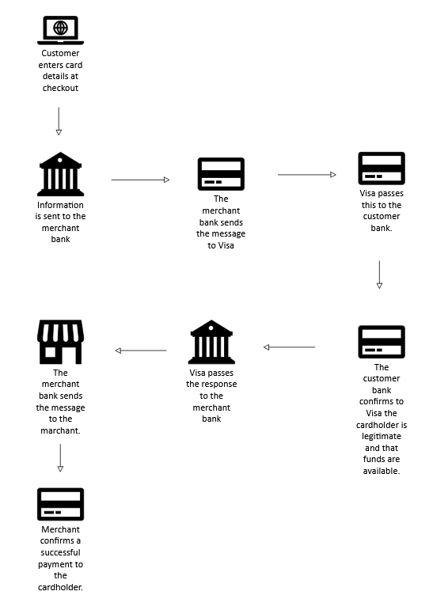
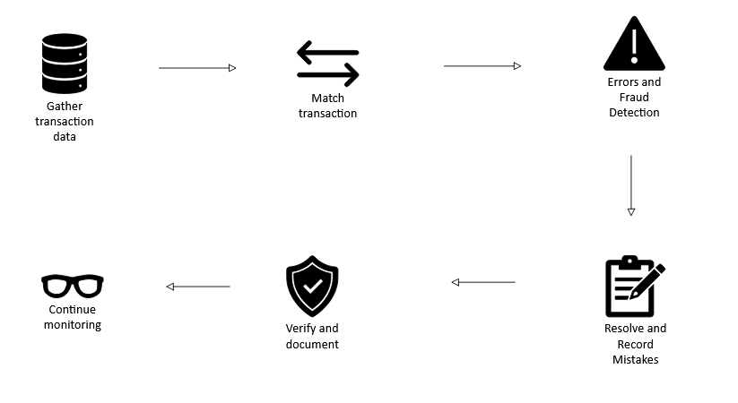
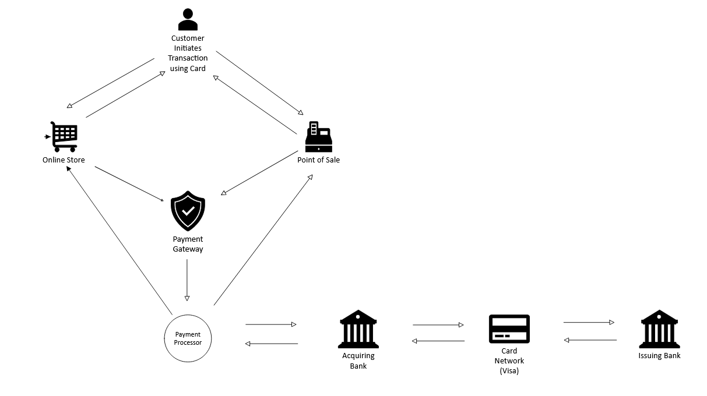

## Introduction
Your article content goes here...

# Introduction To Payments

## **Introduction**

This will be the beginning of a series that dives deep into the Banking and Payments sector. Since money is part and parcel of our lives, everyone ought to know how their money moves whenever they make a purchase or a sale. In this article, we will provide a brief overview of how payments operate behind the scenes, from the moment you swipe your card to the moment the money ends up in the other involved party’s account. 

Payment is the exchange of value between two parties, or a buyer and seller. In modern society, this mostly takes the form of money, but not exclusively. The modern economy operates on plastic card payments (Debit/Credit Cards), electronic payments(Funds Transfer over the Internet), and digital currency payments. 

Payments are the lifeblood of the economy. It allows buyers and sellers to easily exchange goods and services. Efficient payment systems ensure that money flows seamlessly between individuals, businesses, and institutions. Digital payments have made buyers buy more, which in turn translates into business growth and eventually results in economic growth of any country.

## Payment Processing

These are the steps that money takes when it moves from one person or entity to another.  Payment processing facilitates trade and supports economic growth through the movement of money. A well-functioning payment processing system should have mitigations to reduce fraud, ensure data security, and maintain compliance with relevant regulations and industry standards.

## Components of Payment Processing

### 1. Customer

 This is the initiator of the payment. The person who swipes the card or purchases something at an online store.

### 2. Merchant

A business or service provider that accepts payment from a customer and, in return, provides a good or service.

### 3. Payment Method

This is the method the customer uses to make the payment, such as a credit card, debit card, electronic wallet, or cryptocurrencies.

### 4. Point of Sale System(POS)

Physical or Digital platform where the transaction takes place such as a website or mobile app.

### 5. Payment Gateway

A service that securely captures and transmits payment information from the POS System to the payment processor or acquiring bank. It ensures encryption and security of sensitive data during the transaction process. It differs from a payment processor, which handles the actual movement of funds.  The user initiates the process by submitting the payment details. It encrypts the data, sends it to the merchant’s acquiring bank, which then routes it to the customer’s issuing bank for authorization. If approved, the transactions are settled later. This helps banks manage transaction volumes securely without direct exposure to raw customer data, e.g., Stripe, PayPal, Square.

### 6. Payment Processor

A third-party that handles the technical aspects of the transaction, including validating payment information, obtaining authorization, and managing communication between the POS or online store and the acquiring bank. They differ from payment gateways, which focus on capturing and encrypting data, while processors manage the backend communication with banks and card networks. Processors enhance efficiency with features like fraud detection and multi-currency support, though their effectiveness depends on integration and compliance. They charge a percentage of the total amount being transferred and a fixed per-transaction charge. Examples are Stripe and WorldPay

### 7. Acquiring Bank

This is the financial institution that holds the merchant’s account and receives the payment on its behalf, processes the transaction and settles the funds in the merchant account. 

### 8. Issuing Bank

This is the financial institution that holds the customer’s account and sends the payment on its behalf, processes the transaction, and settles the difference in the customer’s account. 

### 9. The Card Network (Visa, Mastercard)

Organizations that establish the rules, standards, and infrastructure for processing transactions, using their branded payment instruments. The card network provides the rails, rules, and standards, while the issuing banks act as car rental companies that provide consumers with the vehicles (the cards) to travel across those roads. This distinction is critical for understanding the division of labour in finance: the issuer manages the relationship with the cardholder, including credit limits and rewards, while the network manages the integrity and speed of the transaction data.

### 10. Payment Security

These are protective measures safeguarding financial data during transactions. It prevents unauthorized access, fraud, and breaches using technologies such as encryption and tokenization. Technologies and Standards such as Payment Card Industry Data Security Standard(PCI DSS), tokenization, and encryption that ensures safety and integrity of payment information and protection against fraud and data breaches. Encryption ensures data remains unreadable during transmission, while tokenization replaces sensitive details with valueless identifiers, minimizing risks if systems are compromised. Authentication protocols verify user identities, and real-time fraud detection employs AI to flag anomalies, all underpinned by standards like PCI DSS to enforce consistent protection.

### 11. Settlement and Reconciliation

- Settlement refers to the final transfer of funds in a payment transaction where money moves from the buyer’s issuing bank to the seller’s acquiring bank, minus any fees.

- Reconciliation is matching payment records to confirm consistency among internal accounts, bank statements, and processor reports. It identifies issues like mismatches and fraud after settlement.

To get a clear picture of how the entire process works, here is a design showing how money flows to the receiver.

Here is how money moves in the system. The customer initiates the transaction. It can be through a Point of Sale (POS) system at a mall or through a website. Then the payment gateway encrypts the customer data and forwards it to the payment processor. The payment processor communicates with the bank and forwards the customer data. 

At this stage, fraud detection is done to ensure there is no theft. The acquiring bank sends a request via the card network to the issuing bank. The request contains instructions to remove the amount from the customer’s account, or what is referred to as debiting an account in banking terms. The amount moves from the issuing bank via the card network to the acquiring bank. The payment processor receives a confirmation message from the bank that the transaction was successful, then it forwards the message to the online store or POS for reporting and reconciliation.

With this brief explanation, you should now have some understanding of what happens every time you use your debit or credit card. In the next chapter, we will be looking at the various types of bank accounts.