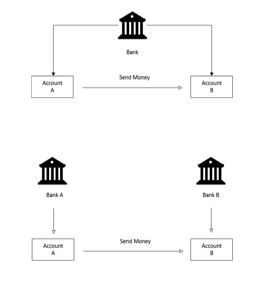
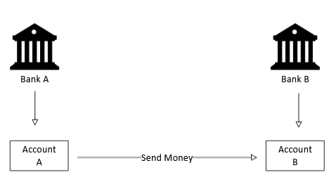

# Types of Bank Accounts

Created time: February 9, 2026 12:14 PM

## **Overview**

In this article, we will be looking at how money moves from one person’s account to another or from one account to another. This process has two scenarios. Money can be moved from one account to another within the same bank or between accounts in different banks.

### **Types of Accounts**

**Demand Deposit Account**

This is a bank account that you can withdraw from on demand. The most common types are checking and savings accounts. They are classified as International Bank Account Number (IBAN), Basic Bank Account Number(BBAN) & Proprietary. 

**IBAN** is an internationally agreed-upon system for identifying bank accounts across national borders. Here is an example of what it constitutes:

| **Section** | **Code** | **Description** |
| --- | --- | --- |
| **Country Code** | `GB` | United Kingdom |
| **Check Digits** | `29` | Verification numbers |
| **BBAN (Bank Code)** | `NWBK` | NatWest Bank |
| **BBAN (Sort Code)** | `409375` | Specific branch identifier |
| **BBAN (Account)** | `42947395` | Individual customer account |

Account: GB29 NWBK 4093 7555 9473 95

The **BBAN** is the "domestic" part of your account identifier. It is the portion of the IBAN that a specific country's banking system uses to route money domestically.

While the IBAN has a fixed structure, the **BBAN format varies by country.** Each nation decides how long it is and what information it contains

| **Section** | **Code** | **Description** |
| --- | --- | --- |
| **BBAN (Bank Code)** | `NWBK` | NatWest Bank |
| **BBAN (Sort Code)** | `409375` | Specific branch identifier |
| **BBAN (Account)** | `42947395` | Individual customer account |

For **Proprietary** the account number depends on an individual bank. The characters are usually between 8 to 18 in length. Think of it as a Customer ID that the bank uses for internal settlements like mortgage payments. It is also used in Closed-loop systems (like some private wealth management platforms) that move money using their own internal logic rather than the global SWIFT/IBAN standards.

## Comparison

| **Feature** | **IBAN** | **BBAN** | **Proprietary** |
| --- | --- | --- | --- |
| **Scope** | International | National/Domestic | Internal/Bank-specific |
| **Standardized** | Yes (ISO 13616) | Yes (within each country) | No (unique to the bank) |
| **Primary Use** | Cross-border transfers | Local transfers | Internal tracking |
| **Example** | GB29 NWBK 4093 7555 9473 95 | NWBK 4093 7555 9473 95 | User_ID_58955-Z |

**Suspense Account**

This account is used to park money temporarily until the payment flow is completed. It is used when a transaction cannot be immediately categorized or posted to the correct account due to missing information or a discrepancy. Some of the common scenarios during which it can be used are: 

- **Mortgage Overpayments:** If you send your bank $1,200 but your monthly mortgage is only $1,150, the bank might put the extra $50 into a suspense account until they can verify if you want it applied to the principal, the interest, or held for next month.
- **Disputed Charges:** If you tell your bank a charge is fraudulent, they might move those funds into a suspense account while they investigate who is right.

**Settlement Accounts**

This is the account to discharge obligations between two different banks which is maintained at the Central Bank. These accounts are used for domestic settlements. Both banks use their settlement accounts to square up the debt at the end of the day or in real-time.  

If you purchase a product at a store using a debit card of Chase Bank and the store uses Bank of America, the first thing that will happen is that Chase Bank will approve the transfer and the balance will drop immediately.  The transaction is stored in the Settlement Account in the Central Bank. Bank of America will not receive the cash immediately, instead it will receive a promise to get the cash. At the end of the day Chase Bank and Bank of America look at the thousands of transactions and they calculate the net payment. The bank that is owed money from the difference receives the net payment from the Settlement Account at the Central Bank. 

The problem that this solves is that it removes that millions of bank transfers that would make the financial system chaotic. This in banking terms is what is known as **Netting**. The banks do not settle the millions of transactions individual but they settle it as the difference on a massive scale. This is referred as Deferred Net Settlement where transactions are bundled together and settled at a go at the end of day e.g checks. For real-time settlements Real-Time Gross Settlement **(RTGS)** is used. 

**Nostro/Vostro/ Accounts**

Nostro Accounts are settlement accounts used by banks for Cross-Border Payments. These accounts are held by domestic banks in a foreign country in the foreign country’s currency. An example would be if you send £500 to someone in Britain using your local bank in the USA. Since the two countries use different currencies, Chase Bank in the USA has to have a Nostro Account at Barclays Bank in Britain. Chase removes the equivalent of £500 from your account and sends a message to Barclays bank in Britain to deposit £500 from its Nostro account to the receivers account. This eliminates the need for physical currency exchanges, which allows for the movement of money in local currencies without delay.

These two terms (Nostro and Vostro) define the same account. Nostro is used by the bank that owns the money. Vostro is used by the bank that hosts the account. 

**Mirror Accounts**

This is an internal ledger that acts as a duplicate for an account held elsewhere. It is a record that your bank has of its Nostro Account in its own system to track what should be in the foreign account. Every time money moves, there must be a corresponding entry in the bank’s internal world to keep the books balanced. 

When £500 is sent from Chase Bank in USA to an account in Barclays Bank in Britain, Chase Bank instructs Barclays to pay £500 from their Nostro Account. The Nostro Account drops its balance by £500. Chase Bank immediately records a debit of £500 in its internal Mirror Account. At the end of the day, the bank compares the Mirror Account with the Nostro Statement. If the two match, the account is reconciled. If the amount is not the same, the bank knows that a transaction has failed. This creates an audit trail and helps the bank know its foreign currency balance at any time.

You now have a clear understanding of the different bank accounts and how they aid in the movement of your money. In the next article, we will be looking at messages, clearing, and settlements in the banking sector.