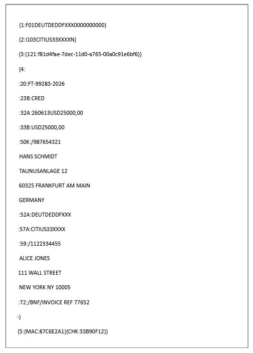
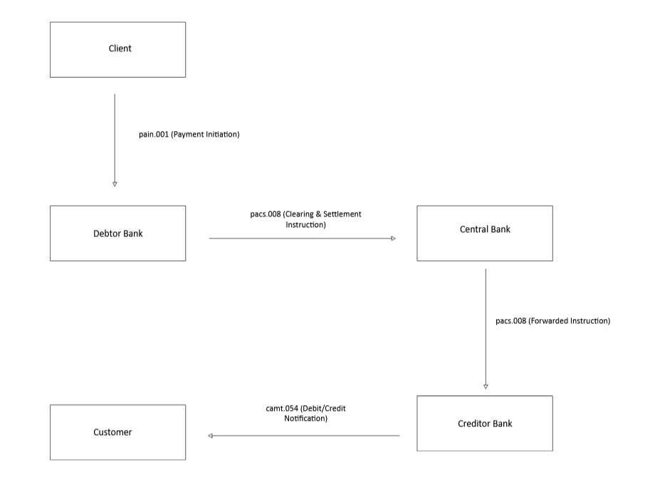
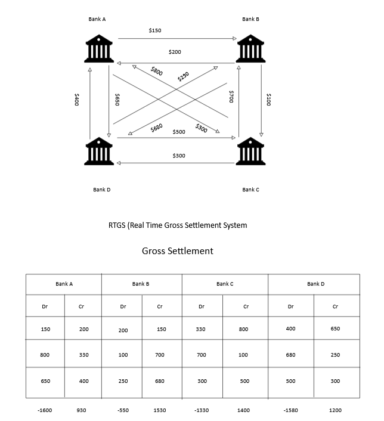
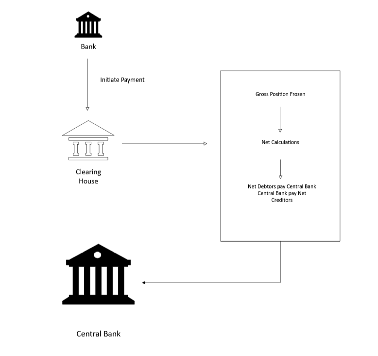
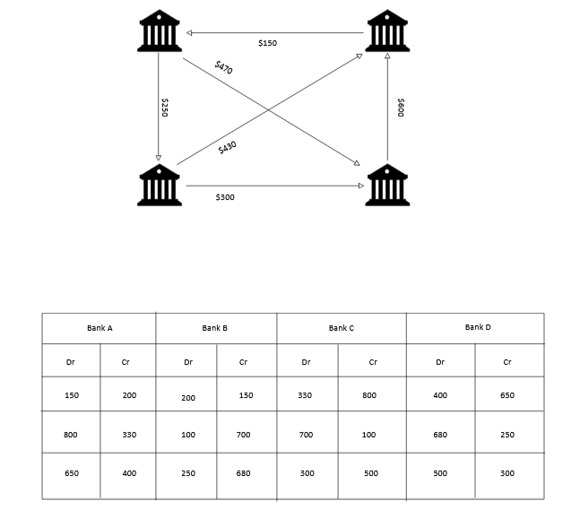
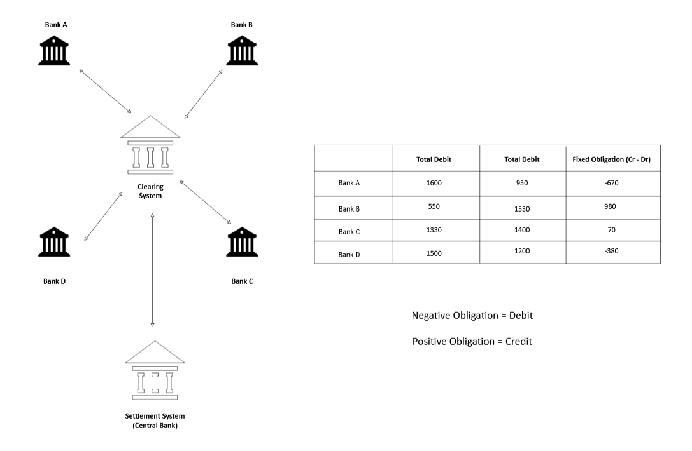

## INTRODUCTION

In this article, we will cover Messages, Clearing, and Settlements. These are steps or processes that your money undergoes in order to facilitate its movement from one bank to another while ensuring correctness. By the end of this article, we will have an understanding of how money is handled as it moves from your bank to another bank.

### MESSAGES

This is the communication between the banks and any other financial institution or between the customer to bank. The messages are usually defined by the system that offers them. There are various messages that are available for communication, and each of them is used for a specific purpose. Every banking message must answer four fundamental questions with absolute mathematical and logical certainty:

- **Who is sending the instructions?** (Originator)
- **Who is receiving the instructions?** (Receiver)
- **What is the payload?** (Amount, currency, value date, and remittance info)
- **Is it authentic?** (Digital signatures and cryptographic wrappers)

To ensure that different core banking systems built on different technologies, languages, and databases can talk to each other, these messages must follow highly rigid, predictable formats.

### Categories of Messages

**Value Message**

Used for money movement (Customer Credit/Return/Debits). Given by Account Owner. E.g pacs.008, pacs.009, pacs.007, pacs.004. It moves money from one account to another. pacs stands for **Payments Clearing and Settlement.**

**Non-Value Message**

Used for non-money movement activities such as requests, responses, reports, or enquiries. E.g pacs.002 pacs.028, camt.056, camt.029. This only transmits data, inquiries, status updates, or reports without changing anyone's financial position. camt stands for **Cash Management.**

### Types of Messages

#### SWIFT MT Standard

SWIFT Message Types (MT) is a standard format for sending messages to financial institutions on the SWIFT Network. All SWIFT messages include the literal “MT” and are followed by a three-digit number that denotes the message category, group, and type.

**Common Message Types:**

1. **MT 103:** Single Customer Credit Transfer (used for standard international wire transfers).
2. **MT 202:** General Financial Institution Transfer (used for bank-to-bank cover payments).
3. **MT 940:** Customer Statement (used for end-of-day balance reporting).

To ensure a message can be parsed flawlessly by automated systems, it is rigidly divided into standard blocks. While formats vary, a typical interbank payment message structure has:

1. Basic Header Block: Contains information about the message type, sender, and receiver.
2. Application Header Block: Specifies the application and service that will process the message
3. User Header Block: Customizable header information
4. Text Block: The actual content of the message
5. Trailer Block: Contains control information and checksums

**Example of Swift Message**

**SWIFT Message Categories**

| Category | Message Type | Description | Number of Message Types |
| --- | --- | --- | --- |
| 0 | MT0xx | System messages | - |
| 1 | MT1xx | Customer Payments and cheques | 19 |
| 2 | MT2xx | Financial Institution Transfers | 18 |
| 3 | MT3xx | Treasury Markets | 27 |
| 4 | MT4xx | Collection and Cash Letters | 17 |
| 5 | MT5xx | Securities Markets | 60 |
| 6 | MT6xx | Treasury Markets - metals and syndications | 22 |
| 7 | MT7xx | Documentary credits and guarantees | 29 |
| 8 | MT8xx | Traveller’s cheques | 11 |
| 9 | MT9xx | Cash management and customer status | 21 |

Categories 1, 2, and 9 are used for payments. We will look at SWIFT Payments in detail in another article.

#### ISO 20022 (The MX Standard)

All banks worldwide implement this message. This is because this is the new standard. It is an XML schema that defines the structure of all ISO20022 messages.  It is highly granular, allowing banks to embed rich, structured metadata directly into the message, such as the actual structural address of the ultimate debtor, tax identifiers, and invoices.

**Importance of ISO20022**

1. It harmonizes all banks across the world to send payments in the same way.
2. It has interoperability. It makes it easy for different banks to understand messages.
3. It makes it easy to enrich data by adding additional important information in the money transfer process.
4. Less costly and no ambiguity. Since there are minimal errors when processing messages. Messages are fixed.
5. It has better compliance. 

ISO 20022 categorizes messages by business domains using specific four-letter prefixes:

- **`pacs` (Payments Clearing and Settlement):** Bank-to-bank messages. For example, a **pacs.008** is the modern equivalent of an MT 103 credit transfer, while a **pacs.009** handles core financial institution transfers.
- **`pain` (Payment Initiation):** Customer-to-bank messages. Used by corporate clients to instruct their banks to initiate payments (**pain.001**) or direct debits.
- **`camt` (Cash Management):** Messages for reporting account balances, statements (**camt.053**), and payment status notifications.

#### The Lifecycle of a Message

To see how messages behave, look at a standard cross-border payment sequence using modern ISO 20022 components:

1. **Initiation:** The sender instructs Bank A to move money using a **pain.001** message.
2. **Validation & Routing:** Bank A validates the account balance, screens the transaction for AML (Anti-Money Laundering) compliance, and converts the request into a **pacs.008** message, and routes it to the clearing infrastructure.
3. **Settlement:** The central system processes the message, handles the ledger adjustment (such as debiting Bank A’s account and crediting Bank B’s account), and forwards the **pacs.008** to Bank B.
4. **Notification:** Bank B receives the message, credits the final beneficiary, and triggers a **camt.054** notification to inform them that the funds have arrived.

#### Attributes of Modern Banking Messages

1. Financial messages must enforce idempotency. Every message contains a unique End-to-End Identification. If a network glitch occurs and a message is re-sent, the receiving bank uses this ID to prevent duplicating the debit or credit. This helps in preventing an account been charged twice from the same transaction.
2. It must have Straight-Through Processing. If a message is structured perfectly according to protocol rules, it can move from initiation to settlement without a human agent ever touching it. High STP rates drastically lower processing costs and execution times.
3. It must ensure cryptographic security**.** Messages do not travel over the open web in plain text. Networks like SWIFT, Fedwire, or TARGET2 wrap these message payloads inside secure network layers utilizing hardware security modules (HSMs), mutual TLS, and digital signatures to guarantee non-repudiation.

## CLEARING

It is the process of transmitting and reconciling the payment transactions prior to settlement, potentially including the netting of orders and the establishment of final positions for settlement. The clearing house is responsible for matching the payer and payee transactions. It defines the transaction message structure, validates & reconciles payment transactions, and calculates the final net obligation. 

In simple terms, when money moves from one bank to a different bank, the banks must first talk to each other, verify that the money exists, calculate who owes what, and prepare for the final movement of funds.

Clearing is everything that happens **after** a transaction is initiated but **before** the final money actually changes hands.

### Steps of the Clearing Process

1. Validation. The recipient's bank collects the payment details and sends them to a central clearing house or network. The system validates the data, checking that the account numbers are correct, the digital signatures are valid, and the message format is correct.
2. Verification. The paying bank checks the payer’s account to ensure there are sufficient funds or credit available.
3. Netting. Instead of moving money back and forth for every single transaction, and clearing houses calculate the net balances. If Bank A owes Bank B $5 million today, and Bank B owes Bank A $2 million, the clearing system sends the difference. The final instruction will be that Bank A owes Bank B 3 million.

### Types of Clearing Systems

1. Modern fast-payment systems like instant mobile/RTGS systems clear transactions in near real-time. The system validates the transaction parameters and checks fund availability within milliseconds, allowing the recipient to access the funds immediately, even if the formal accounting settlement happens later.
2. Bilateral Clearing. 
When two banks based in different countries move large sums of money between each other, especially if they are in two different countries, they maintain Nostro and Vostro accounts. They then clear transactions by adjusting the balances on these internal ledgers without involving a third party.
3. Central Clearing. For most retail payments, banks use an Automated Clearing House. Banks send all their daily transactions to this central hub. The central hub aggregates thousands of transactions, handles the complex math of netting, and sends the final instructions to the central bank for ultimate settlement.

## SETTLEMENT

This is the process of an actual money movement from the sender bank’s account to the receiver bank’s account. Settlement happens using the account maintained in the central bank for the obligation calculated by the clearing system. Below are the classifications of settlements.

### Gross Settlement

This is a settlement of an individual transaction. It is settled in almost real time; hence, it is called Real Time Gross Settlement. It requires high liquidity for settlement since the payment transactions are settled individually, sequentially, and on a transaction-by-transaction basis.

In a gross settlement framework such as **Real-Time Gross Settlement (RTGS)** systems run by central banks, the process moves through three steps for every single transaction:

1. **Submission.** The sending bank (Bank A) transmits a gross payment instruction to the settlement agent (usually the central bank).
2. **Validation.** The settlement engine checks Bank A's central bank reserve account. If Bank A has sufficient funds to cover the gross value of the transfer, the transaction proceeds. If funds are insufficient, the transaction is either rejected outright or placed into a central processing queue until liquidity becomes available.
3. **Settlement.** The central bank debits Bank A's reserve account and credits Bank B's reserve account. Once this ledger entry is made, the payment is legally final and irrevocable.

The main advantage of gross settlement is that it eliminates systemic settlement risk since every transaction is final the moment it is processed; there is no "unwind" risk. Unwinding means undoing the calculation of net settlements and returning the clearing system to its previous state. This occurs when a bank accumulates too much net debt and is unable to meet it at the required time. If a bank fails at 3:00 PM, all transactions processed prior to 3:00 PM are safe and settled. There is no domino effect threatening the stability of the clearing house.

### Net Settlement

In banking and financial market infrastructure, **Net Settlement** is a mechanism where the total obligations between multiple financial institutions are accumulated over a specific period, offset against one another, and settled using a single net figure.

Instead of moving funds for every individual transaction (which happens in Gross Settlement), a net settlement system consolidates the flows to drastically reduce the volume and value of actual monetary transfers.

A standard net settlement process follows a strict timeline throughout the operating day:

1. **Clearing Phase:** Throughout the day, consumers and businesses make payments (e.g., ACH payroll, debit card swipes). The clearing house validates these messages, and tracks the shifting liabilities.
2. **The Cut-off:** At predetermined intervals or at the end of the business day, the clearing window closes (EOD).
3. **Calculation:** The clearing house aggregates the gross volumes and generates a net settlement report. The sum of all net debit positions always equals the sum of all net credit positions .
4. **Final Settlement:** Net debtors transfer their owed balances to a centralized settlement account at the central bank. Once all debtor funds are received, the central bank distributes those funds to the net creditors.

**Importance of Net Settlement**

- It lowers operational cost**.** Processing thousands of individual bank-to-bank gross ledger updates is resource-intensive. Settling once or twice a day reduces processing overhead and network traffic.
- It ensures Liquidity**.** Banks do not need to hold trillions of dollars in central bank reserves to fund trillions of dollars in daily consumer commerce. They only need the amount to cover the difference of what each party owes the other.

### Bi-lateral Net Settlement

This is executed based on the mutual agreement between the two banks. Both inward and outward payment transactions are netted and settled, typically via a transfer between their accounts.

### Multi-lateral Net Settlement

It is a process of calculating the net obligation between a sender bank and all other banks that are part of the clearing system. The clearing system makes the process easier by calculating all the payment traffic of each participating bank, which drastically reduces the number of transactions. At the time of the settlement, the final net obligation is sent to the settlement system for the money movement. The beneficiary account is credited only after the actual inter-bank settlement is completed.

### Deferred Net Settlement

This is a settlement where transactions between financial institutions, which processes and settles each transaction individually and instantly, DNS batches transactions over a specific period and settles the net differences.

Here is a detailed breakdown of how it works, its architecture, and its risk profile.

The steps it follows are:

**1. Clearing**

Banks send payment instructions to a central clearing house. The clearing house records who owes what.

**2. Netting**

At a designated cut-off time, such as End of Day(EOD) the clearing house calculates the net position of each participant.

**3. Settlement**

The final net balances are settled across the books of a central bank. Net debtors(The party or institution that owes many or has a negative account balance) must fund their accounts to pay out, while net creditors(The party owed money) receive their net earnings.

Since transactions are netted, the actual amount of central bank money (liquidity) required to settle a vast volume of payments is remarkably low since banks don't need to hold massive reserve balances to cover gross intraday payments. This is helpful, although it exposes the system to a number of risks. 

To combat risk while preserving liquidity efficiency, DNS systems (like ACH networks or domestic retail payment rails) implement strict risk controls mandated by international standards (such as CPSS-IOSCO Principles for Financial Market Infrastructures):

- **Collateral Pools:** Participants must pre-fund or post collateral (like government bonds) at the central bank to cover their largest possible net debit position. If a bank defaults, its collateral is liquidated to settle the cycle.
- **Loss-Sharing Agreements:** Surviving participants agree to proportionally cover the shortfall of a defaulting member to guarantee settlement finality.
- **Net Debit Caps:** Limits are placed on the maximum net debtor position a single bank can accumulate during a cycle.
