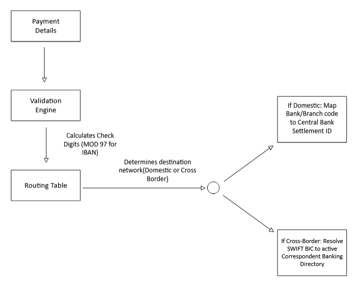

## **Introduction**

In this article, we will look into Routing. This is also known as payment orchestration. It is the process of selecting the most efficient, cheapest, and secure route for a payment to travel from the payer’s account to the payee’s account across financial networks.

This process relies on Routing Identifiers, which are standardized codes that tell the system exactly where the destination sits on the global or domestic network.

### The Routing Journey: Direct vs. Indirect

- **Direct Routing:** If Bank A and Bank B belong to the same domestic clearing house (like a central bank's RTGS or ACH network), the payment routes directly from Bank A, through the clearing house, straight to Bank B.
- **Indirect (Correspondent) Routing:** If Bank A is a small local bank in Kenya and needs to send USD to a small local bank in Japan, they do not have a direct connection. The payment must be routed through one or more intermediary **Correspondent Banks** that hold matching accounts (**Nostro/Vostro**) with each other, acting as hops along the route.

### Types of Routing

**1. Dynamic Routing**

This is mostly used by modern payment gateways, e-commerce networks, and fintech applications to maximize transaction success rates and minimize processing failures. Instead of using a single processor for payments, the routing engine evaluates multiple payment processors, acquiring banks, or card networks in real time.
If a specific acquiring bank is experiencing a sudden spike in latency or has network issues, the transaction is routed to an alternate processor.
****

**2. Cost-Based Routing** 

For commercial enterprises, retail giants, and high-volume merchant aggregators, transaction processing fees can severely eat into profit margins. Cost-based routing optimizes for the bottom line. The routing engine evaluates the transaction amount, currency, and the payment instrument being used (e.g., credit card vs. debit card vs. bank transfer) to find the cheapest route. 

If a customer pays with a debit card, the system may bypass global card networks (like Visa or Mastercard) and route the transaction directly through a cheaper domestic debit rail.
This reduces interchange and processing fees for high-volume operations.
****

**3. Systemic Routing**

Banks handle everything from tiny peer-to-peer retail transfers to massive multi-million dollar corporate acquisitions. Systemic routing categorizes payments based on their financial weight and urgency.
• **High-Value Routing (RTGS):** If a corporate payment exceeds a specific threshold (e.g., over $\$100,000$), the system bypasses standard channels and routes it directly through a **Real-Time Gross Settlement (RTGS)** network like Fedwire or TARGET2. This guarantees instant finality and eliminates credit risk.
• **Low-Value Routing (ACH/Batch):** For lower-value, non-urgent transactions like payroll or subscription renewals, the engine routes the data to an **Automated Clearing House (ACH)** pipeline, where transactions are grouped and settled in cost-effective batches.

**4. Cross-Border Routing**

When a payment needs to jump across international borders and convert currencies mid-flight, routing requires multiple structural hops.
• **Correspondent Bank Routing:** If the sending bank does not have a direct relationship with the receiving bank in another country, the routing engine calculates a chain of intermediary Correspondent Banks. The payment moves through a series of Nostro and Vostro ledger updates until it hits the destination country's local clearing network.
• **FX Optimization Routing:** The engine can evaluate multiple liquidity providers or internal FX desks to route the payment through whichever channel offers the tightest currency spread at that exact millisecond.

**5. Peer-to-Peer (P2P) & Alias Routing**

Modern retail payments are shifting away from forcing consumers to memorize long, clunky account numbers or IBANs. Instead, systems use alias registries. The routing engine relies on a centralized directory mapping an alias (like a phone number, email address, or National ID) to a specific bank account.
When you send money to a phone number on a network like Pix in Brazil, Zelle in the US, or mobile money rails in East Africa(MPESA & Airtel Money), the routing engine hits an alias resolution API first to fetch the target bank's identifier codes before instantly dispatching the funds.

### Routing Identifiers

BBIC or SWIFT Code

Business Identifier Code has a character length of 8 or 11 and is used to identify the Banks/Corporations in a cross border & SEPA payments, e.g., CITIUS33, SBININBB451

CITI - Bank Code

US - United States of America

33- Location Code

SBIN - Bank Code

IN - India

BB - Location Code

451 - Branch Code

Some banks do not indicate the branch code since it is optional

### How the Routing Engine Translates Identifiers

When an application or a core banking platform initiates a payment, it executes a lookup and verification process under the hood:

1. **Checksum Validation:** The system runs mathematical validation (like check digits) to ensure the code is structurally sound before attempting to route.
2. **Directory Resolution:** The bank's payment engine queries up-to-date global directories (such as the SWIFTRef directory) to translate the identifier into an active settlement network routing address.
3. **Message Generation:** The identifier determines the exact routing headers injected into the payment message payload, ensuring it travels along the correct financial rails.

### Routing Messages

**American Bankers Association Code (ABA)**

- This is called the ABA Routing Transit Number (ABA-RTN) and has a length of 9 digits. This is unique for each of the banks. An example is 021000021.

Federal Reserve Routing Symbol (First 4 Digits): 0210
- Digits 1-2 (Federal Reserve District): 02 represents the 2nd Federal Reserve District (New York).
- Digit 3: Indicates the specific Federal Reserve check processing center or sub-district.
- Digit 4: Identifies the type of financial institution or the specific clearing system state/territory code (e.g., whether it is a commercial bank).

Institution Identifier (Digits 5–8): 0002. This uniquely identifies the specific bank within that Federal Reserve district.
Check Digit (9th Digit): 1. This is a single digit calculated using a specific mathematical formula (the Modulus 10 algorithm) applied to the first 8 digits. Electronic payment systems use this digit to instantly verify that the routing number is valid and was not mistyped.

**Indian Financial System Code (IFSC)**

- This is an 11-digit alphanumeric code that is unique and used to identify the bank branch that offers online money transfer. It is typically located in three places: Cheque Leaf, Passbook(Usually found on the front page alongside the account number and holder details), Net Banking / Mobile App(Listed under account details or branch information profiles). An example is SBIN0004321.

- Bank Code (First 4 Characters): SBIN
This represents the bank name. In this case, SBIN stands for the State Bank of India.
- Control Character (5th Character): 0
This is a control character that is always set to zero (0) across all banks. It is reserved for future use by the central bank.
- Branch Code (Last 6 Characters): 004321
This uniquely identifies the specific physical or digital branch of that bank. It is usually numeric but can occasionally contain alphabetic characters for newer branches.

**Sort Code - UK**

- This is a 6-digit code that helps to identify the bank branches while routing an online payment. An example is 20-04-04. 
- Bank/Settlement Code (First 2 Digits): 20. This identifies the major banking group or clearing settlement member. The 20 range belongs entirely to Barclays.
- Branch Identifier (Last 4 Digits): 04-04. These four digits pinpoint the specific physical branch, regional processing hub, or specialized digital center within that bank’s internal ledger network.

Details needed to make online payments

From Customer’s perspective

1. Originator’s Account
2. Beneficiary’s Account
3. Beneficiary’s Bank Identification (IFSC, ABA, Sort Code, BIC)
4. Date
5. Amount & Currency
6. Remarks for making payment. Additional information about the payment.