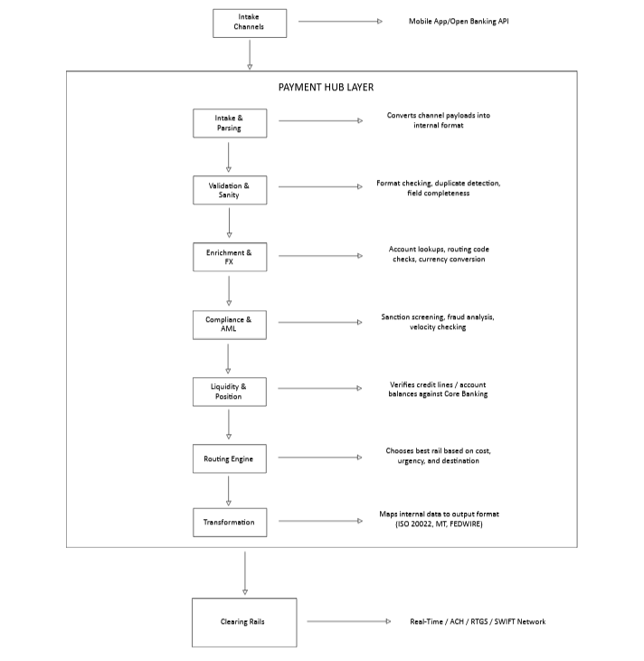
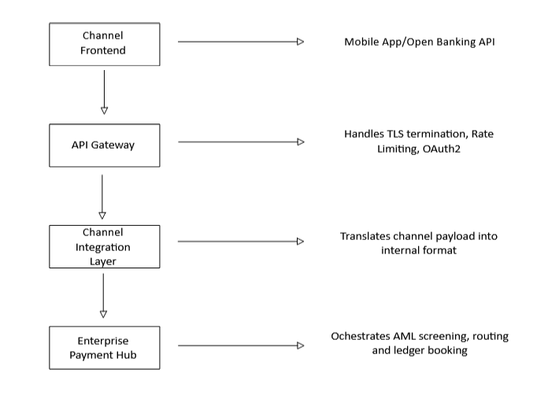
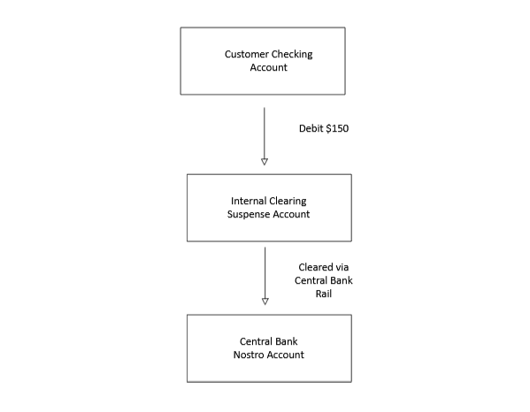
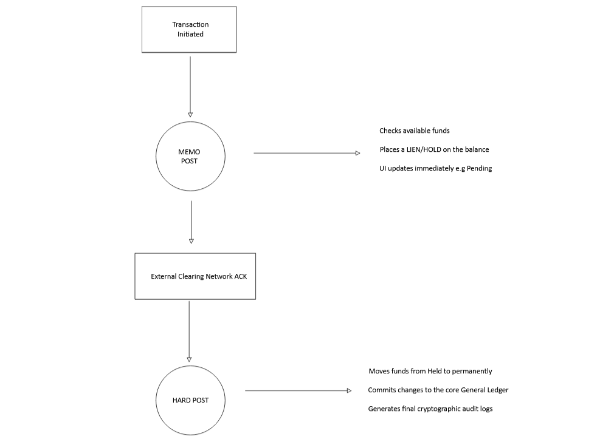

## Overview

In this article, we will look at Payment Processing. Payment processing in banking refers to the system that enables the secure transfer of funds between a payer and a payee, typically involving the authorization, verification, and settlement of transactions. 

## Payment Acquisition

It is the process by which a bank or financial institution processes credit or debit card transactions on behalf of a merchant, ensuring that funds are securely captured from the customer's bank and deposited into the merchant’s account.

#### Acquisition Fees

| **Fee Component**           | **Paid To**         | **Description**                                                      |
| --------------------------- | ------------------- | -------------------------------------------------------------------- |
| **Interchange Fee**         | **Issuer**          | The largest portion of the fee. Set by the schemes but paid to the   |
|                             |                     | customer's bank to cover credit risk and fraud management.           |
|                             |                     |                                                                      |
| **Assessment / Scheme Fee** | **Card Network**    | Paid to Visa/Mastercard for operating the global network             |
|                             |                     | infrastructure.                                                      |
|                             |                     |                                                                      |
| **Acquirer Markup**         | **Acquirer / PSP**  | The fee charged by the acquiring bank for providing the processing   |
|                             |                     | services, hardware, and handling risks.                              |
| --------------------------- | ------------------- | -------------------------------------------------------------------- |

## Payment Hub

A payment hub in banking is a centralized platform that consolidates and orchestrates all payment types—such as ACH(Automated Clearing House), Wires, instant transfers, fraud detection and cross-border remittances—into a single unified infrastructure. In a way, it also helps banks to tackle risks that come from having many different ways of processing payments

## Payment Channel

Customer initiates a payment request using this system. Then, different types of inputs are allowed to initiate a payment for the customers. There two types of channels **Offline Channels** and **Offline Channels**. In Offline Channel (Phone banking, Challan, Email, Cheque), any errors can be fixed in before hand with a help of a bank staff. This in turns makes it slower. In Online Channels (Net Banking, Google Pay, Wallets, POS), errors can be identified only at the last stage as a payment response. This makes it take less time as STP(Straight-Thorugh Processing). 

Connects with the Bank’s payment systems via MQ, API, Internet; hence, a proper security protocol is a must. The bank needs a different payment channel for its growth. This is the flow of money in a payment hub.

### Types of Channels

#### Digital Channels (Retail & SME)

- **Mobile & Internet Banking:** Consumer-facing web apps and native iOS/Android apps. They typically interact with the bank's backend via secure RESTful JSON APIs.
- **USSD (Unstructured Supplementary Service Data):** A lightweight, session-based protocol running over GSM(Global System for Mobile Communications) network signaling tracks. Crucial for financial inclusion and offline/feature-phone banking, it requires extreme payload optimization due to character limits and tight session timeouts.
- **Open Banking APIs:** Exposed entry points that allow authorized third-party providers (TPPs) to initiate payments directly from a customer's account under regulatory frameworks (like Payment Services Directive 2).

#### Corporate & Institutional Channels

- **Host-to-Host (H2H):** A secure, direct machine-to-machine connection between a corporate client’s ERP system (like SAP or Oracle) and the bank's processing network. Transactions are typically transmitted as bulk batch files (e.g., ISO 20022 XML, EDIFACT) using automated SFTP or specialized VPN lines.
- **SWIFT for Corporates:** Allows high-net-worth enterprise clients to plug their treasury systems directly into the global SWIFT network to inject multi-currency payment instructions directly into the bank's international processing desks.

#### Assisted & Physical Channels

- **POS (Point of Sale) & ATM Networks:** Physical hardware endpoints interacting via standard ISO 8583 messages. They utilize specialized encryption layers to handle physical chip data (EMV) and PIN verification blocks.

## Connection Interface/Payment Gateway

Connects the Bank’s payment system with the Market Infrastructures(Clearing/SWIFT/Card Network). Payment Transaction exchange with PMI is done by these systems based on the routing logic decided by the payment engine. Some systems add the signature on top of the payment transaction message while sending outward or validate the signature on received payment transactions. These systems are connected with the Market Infrastructures as per the definition, mostly by API or MQ(Message Queue).

A **Payment Gateway** is the software infrastructure that securely captures, encrypts, and validates customer payment data at the digital point of sale (e-commerce checkout or mobile app) and routes it into the banking ecosystem.

It acts as the crucial bridging layer between the public merchant storefront and the highly secure financial processing networks. Additional features/validations related to the message exchange are performed in this system.

#### Responsibilities of a Gateway

**1. Tokenization & PCI Scope Reduction**

To protect sensitive cardholder data, modern payment gateways rely heavily on **Tokenization**. When a user types their card number (PAN) into a checkout field, the data is captured via an integrated iframe or SDK provided by the gateway.

- The raw PAN is sent directly from the browser to the gateway's secure vault.
- The gateway replaces the PAN with a mathematically unrelated string called a **Token**.
- The token is returned to the merchant's server. This ensures the merchant's application servers never touch, store, or transmit raw credit card numbers.

**2. Payer Authentication**

The gateway orchestrates the **3DS** protocol (Visa Secure, Mastercard Identity Check). For high-risk or regulated transactions (such as under Europe's PSD2 SCA mandates), the gateway acts as the protocol manager. It facilitates a silent, background data exchange between the merchant and the Issuing Bank (device fingerprint, IP address, behavioral data) to authenticate the user without a frictionless-killing OTP challenge, prompting for a biometric/SMS challenge only when anomalies are detected.

**3. Gateway-Level Smart Routing**

Advanced banking gateways don't just blindly pass traffic forward; they evaluate downstream availability. If an acquiring bank's processing switch is experiencing latency or a regional outage, the gateway's routing engine can dynamically redirect the authorization request payload to an alternative secondary processing rail to ensure high platform uptime.

# Transactions

These are events that cause the movement of money from one account to another.

## Outward Transactions

This is an outgoing payment which occurs when a customer instructs their bank to move funds from an internal account to an external beneficiary at another financial institution.

#### Processing Pipeline

**1. Ingress & Canonicalization**

The payment enters via an intake channel (Mobile API, Corporate Host-to-Host). The bank's channel integration layer parses the incoming payload and maps it into the internal canonical format—typically an **ISO 20022 `pain.001` (Payment Initiation)** data structure.

**2. Syntactic & Business Validation**

The engine checks if fields match structural schemas, validates identifiers (e.g., evaluating routing numbers like SWIFT BICs, ABA, or Sort Codes using MOD-check algorithms), and verifies that the transaction date falls within valid settlement windows.

**3. Compliance Screening (AML/Sanctions)**

The payload is passed to the compliance engine. It runs the names of the sender and beneficiary against international sanctions lists (e.g., OFAC) and flags suspected money laundering patterns. This step must block the pipeline in real-time; any hits route the transaction to manual compliance desks.

**4. Liquidity & Position Check**

The system queries the Core Banking System ledger to check for available funds. If the account has sufficient balance or an approved overdraft limit, the engine places a lien (hold) on the requested funds. This prevents the customer from double-spending the money while the transaction is cleared externally.

**5. Routing & Transformation**

The routing switch chooses the optimal outbound clearing rail (RTGS for high-value/urgent, ACH for low-value/batch, or local instant rails). The internal payload is then converted into the target network protocol (e.g., an **ISO 20022 `pacs.008`** or a legacy **SWIFT MT103** message).

**6. Disbursement & Posting**

The message is cryptographically signed and dispatched to the clearing rail. Upon receiving an acknowledgment (`ACK`) from the external network, the internal held funds are permanently debited from the customer's account, and the bank offsets this by updating its central clearing settlement ledger.

#### Performance Indicators (KPIs) in Core Processing

For engineering teams maintaining outward transaction systems, performance monitoring centers around three main metrics:

- **STP Rate (Straight-Through Processing):** The percentage of outward payments that pass from the channel to the rail entirely automatically without triggering manual compliance or technical validation exceptions. Enterprise banks target an STP rate greater than **95-98%**.
- **End-to-End Latency:** For instant rails, the target window to pull a payload from an API, run compliance, hold ledger balances, transform the schema, and dispatch it is often under **500 milliseconds**.
- **Reconciliation Match-Rate:** The accuracy with which the outbound payment ledger matches the end-of-day statement files provided by central settlement networks.

## Inward Transactions

This is also known as an incoming payment, which occurs when an external financial institution routes funds onto your bank's network to be credited to one of your customers.
Inward processing is all about safely receiving a message from an external clearing rail, validating the targeted account, handling regulatory compliance, and executing a precise ledger post. Inward transactions must be designed defensively because the bank does not control the ingress rate or format quality of external originators.

### Processing Pipeline
When a clearing network (like an RTGS switch, an ACH operator, or a regional instant payment rail) delivers a payment message to a bank, it flows through a sequential, real-time pipeline.

**1. Ingress & Parsing**

The bank’s gateway receives the network message (e.g., an **ISO 20022 `pacs.008`** message or a legacy **SWIFT MT103** file). The network adapter parses the binary or XML stream into the bank's internal canonical transaction model.

**2. Beneficiary Account Verification**

The engine queries the account sub-system to ensure the target account exists and can receive funds. It checks:\
• Is the account active or frozen/blocked?\
• Does the account type allow this currency?\
• Name Matching. Advanced ML models compare the incoming beneficiary name string with the legal name on the bank account to prevent accidental misrouting.

**3. Inward Compliance & AML Screening**

Even though the sender's bank already ran compliance, the receiving bank is legally responsible for everything it lets into its ledger. The payload is checked against international sanctions, PEP (Politically Exposed Persons) databases, and local anti-money laundering velocity thresholds.

**4. Liquidity & Settlement Posting**

The engine checks the bank's central clearing account position (e.g., its ledger balance at the Central Bank). If the clearing network has already settled the funds into the bank's master position, the hub proceeds to allocate those funds.

**5. Core Ledger Credit Posting**

The hub sends an atomic credit command to the Core Banking System (CBS). The customer’s ledger row is updated. This transaction must be processed as a database write-ahead log to prevent ledger corruption.

**6. Notification & Acknowledgment**

The state machine sends a success notification event (via a message broker like Kafka) to trigger real-time channels like SMS, mobile push alerts, or email webhooks for the customer. Simultaneously, a clearing network acknowledgment (`pacs.002` status report) is returned to the rail.

## Booking of Transactions

**Booking a transaction** is the final, atomic action in banking where a financial record is permanently written to the core ledger. While payment gateways, channels, and hubs handle the orchestration and transmission of a payment, the booking engine changes the actual financial state of an account. This process relies heavily on standard accounting principles executed via high-throughput, distributed system architectures.

#### 1. Double-Entry Bookkeeping Principles

Every transaction booked within a bank must balance perfectly. A bank does not simply increase a number. It moves value between accounts using Debits **(Dr)** and Credits **(Cr)**.

From a bank's perspective, customer deposits are Liabilities (money the bank owes back to the customer). Therefore:

- A **Debit** decreases a customer's balance (reduces the bank's liability).
- A **Credit** increases a customer's balance (increases the bank's liability).

**Internal Mirror & Suspense Accounts**

When money moves outside the bank (like an outward transaction), the ledger cannot directly credit the external bank's account. Instead, banks utilize Internal Nostro/Vostro Mirror Accounts or Suspense Accounts to maintain balance integrity.

#### 2. The Booking Lifecycle: Memo Post vs. Hard Post

To balance real-time user experiences with safe ledger processing, banks typically split booking into two distinct database phases.

With this brief explanation, you should now have some understanding of how payments are handled by banks and processed in a way that each financial institution can be able to understand what should be done with it. In the next chapter, we will be looking at **Payment Chains**.