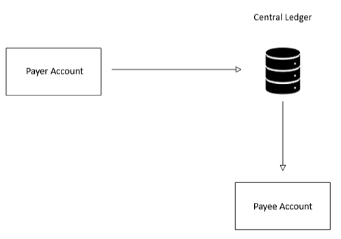
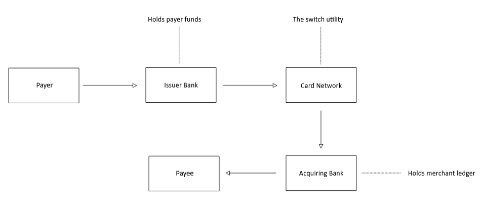
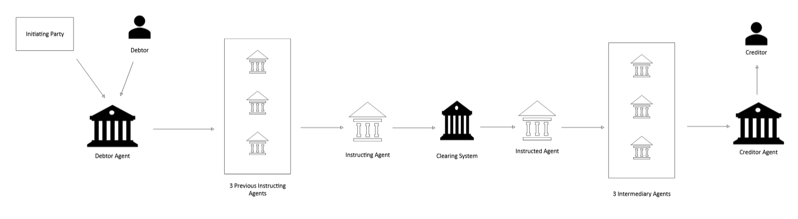

# Banks & Payment Chains

Created time: March 30, 2026 4:14 PM

## Introduction

This mainly pertains to the architecture of payment networks. It is in this space that clearing and settlement process decisions are made.

## Closed Loop

It is also known as a three-party model which controls every stage of the transaction lifecycle. This loop connects the customers (Merchants/Consumers) directly with the payment system. All types of customers must join the payment system as this is being managed as a centralized system.

In this system transactions are executed as internal database updates (book transfers) within a single ecosystem, completely bypassing external interbank rails like Visa, Mastercard Any changes and new features can be introduced faster but growth is limited since both merchants and consumers must join. eg. Paypal, American Express.

### Architecture

In a closed loop, both the consumer and the merchant must be registered participants on the exact same proprietary ledger.

Because the platform acts as the single source of truth, it avoids the extensive routing, compliance handshakes, and settlement steps required in multi-bank configurations.

#### Common Use Cases and Implementations

1. **Closed-Loop Digital Wallets:** Mobile wallets where peer-to-peer or consumer-to-merchant payments occur entirely within the wallet company's database ledger.
2. **Merchant-Specific Gift Cards & Closed Systems:** Starbucks Cards or Amazon gift card balances. Funds are pre-loaded directly onto the merchant's balance sheet and can only be redeemed at their specific nodes.
3. **Closed Loop Transit Networks:** Metropolitan transit cards (London's Oyster card) running on localized contactless chips that calculate fares and deduct value from a private central database.

#### Advantages

- **Ultra-Low Latency:** A transaction is simply an atomic balance shift inside a single database cluster, allowing sub-second settlement times.
- **Granular Data Collection:** Because the platform controls both sides of the transaction, it can capture rich, structural line-item data (SKUs purchased, exact locations) without risking truncation over external bank networks.
- **Direct Dispute Resolution:** Bypasses complex card brand chargeback windows. The platform arbitrates disputes internally via its own transaction management systems.

#### Disadvantages

- The platform is useless to consumers if merchants don't build integrations to accept it, and useless to merchants if consumers don't open accounts.
- **Regulatory Custody Overhead:** Storing customer funds on a single central ledger requires registering as a Money Services Business (MSB) or partnering with a licensed custodial bank to hold the pooled reserves in an omnibus account.

## Open Loop

It is also known as a four-party model. It connects customers (Consumers/Merchants) with the payment system through a bank in the middle layer. All transactions would happen through a bank and it allows them to interact with any other bank without having a direct relationship. It operates as a decentralized financial ecosystem where multiple independent institutions route, clear, and settle transactions using a shared, standardized network infrastructure. Growth is faster as Merchants and Consumers do not have to join the same bank, but there is no guarantee that new features would reach them faster eg. Visa, Mastercard, Credit/Debit Transfers, Cheque.

Unlike a closed-loop system, where a single entity holds the database keys for both the buyer and the seller, an open-loop system allows a consumer holding an account at Bank A to effortlessly purchase goods from a merchant who banking coordinates with Bank B.

### Topology

The defining characteristic of an open-loop system is that the underlying network does not hold deposit accounts. Instead, it acts as a **neutral switching utility** that routes transaction tokens, compliance records, and settlement files across distinct financial node architectures.

Stakeholders involved in every movement of funds are :

1. **The Holder / Payer:** The consumer initiating the transaction.
2. **The Issuer:** The bank or financial institution holding the consumer’s deposits or line of credit.
3. **The Acquirer:** The bank or merchant processor managing the merchant’s corporate ledger.
4. **The Merchant / Payee:** The business accepting the payment.

Open-loop designs serve as the operational backbone of global commerce. Examples of open-loop are:

- **Card Networks:** Visa, Mastercard, and Discover. A Visa card issued by a small local credit union can be swiped at a merchant terminal on the other side of the planet managed by a completely different acquiring entity.
- **Public ACH Networks:** The **NACHA**(National Automated Clearing House Association) network in the United States or the **SEPA**(Single Euro Payments Area) network in Europe. These networks allow thousands of independent banks to batch and route credit and debit files seamlessly between each other.
- **Instant Payment Rails:** Modern real-time networks like **FedNow** in the US, **Pix** in Brazil, or **SEPA Instant**. Independent banks connect to a common real-time central switch to clear and settle transactions within seconds via central bank liquidity pools.

### Two-Phase Lifecycle of Open-Loop Model

Because open-loop systems involve decoupled entities, a single transaction must pass through two distinct operational cycles to ensure security and prevent double-spending:

**Phase 1: Real-Time Authorization (The Switch)**

When a payment is initiated, the merchant's point-of-sale terminal or payment gateway formats the data into an authorization request packet. The **Acquirer** catches this payload and passes it to the **Payment Network Switch**.

The switch instantly analyzes the routing transit number or bank identification number (BIN), routes the packet directly to the **Issuer** to check for fraud and fund availability, catches the approval response token, and relays it back to the merchant. The entire process occurs in milliseconds. For further details refer to the previous article on [https://kwizl.github.io/posts/Introduction-To-Payments/](https://kwizl.github.io/posts/Introduction-To-Payments/)

**Phase 2: Clearing & Settlement**

Authorization does not move the actual money; it simply locks the funds. At the end of an operational business day, the clearing files are compiled.

The payment network acts as the clearing house, calculating the net debit and credit positions across all participating banks. It then interfaces with a settlement system (typically a central bank RTGS architecture) to execute the final, irrevocable transfer of funds from the issuer’s reserve pool to the acquirer's reserve pool. For further reading on this refer to this prrevious article [https://kwizl.github.io/posts/Messages-Clearing-Settlement/](https://kwizl.github.io/posts/Messages-Clearing-Settlement/)

### Actors in the Payment End to End

#### Forwarding Agent

- Holds a relationship with a customer but does not hold an account. Initiates a payment request on behalf of a customer or forwards the already initiated payment request to the debtor agent. Since transaction is just passing through, accounting entry is not required.

#### Debtor Agent

- Sender bank or originating bank. This is the bank which holds an account of the customer who is initiating any outward payment transactions.

#### Instructing Agent

- A bank that instructs the next party on the payment chain to carry out the payment/instruction

#### Instructed Agent

- A bank that executes the instruction upon the request of the previous party in the chain.

#### Previous Instructing Agent

- Other banks are involved in a payment chain to facilitate the transaction between debtor agent and a creditor agent. This is a dynamic role on the payment chain based on which bank is processing a transaction in the payment chain at a given point in time.

#### Intermediary Agent

- A bank between the debtor’s agent (sender bank) and the creditor’s agent(receiving bank) to facilitate the E2E transaction. There can be several intermediary agents specified for the execution of a payment(up to 3 intermediary agents are allowed in ISO20022)

#### Creditor Agent

- This is the Receiving Bank. It holds the account of the customer who is receiving any inward payment transactions and is the end of the interbank payment chain.