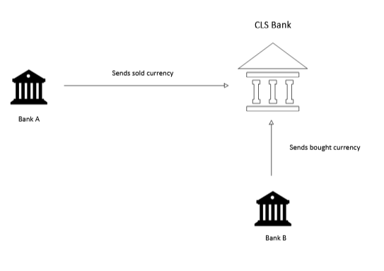
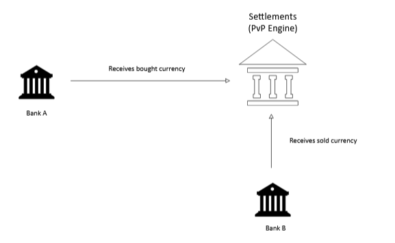

# What is Risk

Refers to the potential losses either in finance or reputation or even could lead to bankruptcy. It is the probability that a transaction will not be completed as expected.

## Credit Risk

This is the possibility that a counterparty will not fufill an obligation either when its due or at any time after. Net settlement systems are likely to be impacted by the credit risk.

Core Components of Credit Risk

1. **Default Risk:** Risk that a borrower will be unable to make the required debt payment.
2. **Concentration Risk:** Risk associated with having too much exposure to a single borrower, industry or geographic region. If that specific sector fails, the lender faces massive losses.
3. **Country Risk:** Also known as Sovereign Risk. This occurs when a foreign government defaults on its bonds or other financial commitments, often due to political instability or economic collapse.
4. **Downgrade Risk:** Risk that a borrower’s credit rating will be lowered. While not a default, a downgrade decreases the market value of the debt held by the lender.

**Scenarios of Risk**

- In high-value payment systems, credit risk occurs during the time between when a payment instruction is sent and when the actual funds are received. Some of the reasons maybe when a bank goes insolvent before the funds are moved at the central bank.
- A consumer uses a credit card to purchase $1,000 worth of electronics. The bank pays the merchant immediately. If the consumer loses their job and stops making monthly payments, the bank carries the $1,000 loss.

**How Credit Risk is Measured**

Banks use these three metrics to get a measure of the potential loss:

1. Probability of Default over a period of time
2. Percentage of the total exposure that will be lost if a default occurs.
3. Exposure at default when borrower fails to pay the debt.

**Mitigation Techniques**

1. Borrow from the Central Bank(Intra-day load)
2. Collateralization of the borrower’s assets that the lender can seize and sell if the loan is not repaid.
3. Legal stipulations in a loan agreement that require the borrower to maintain certain financial health markers like a debt-to-equity ratio of less than 0.5

## Liquidity Risk

- This is a risk that an entity will be unable to meet its short-term financial obligations when they become due, despite potentially owning valuable assets. It is the inability to pay on time.

**Types of Liquidity Risks**

1. **Funding Liquidity:** This occurs when an entity cannot obtain sufficient cash to settle its obligations. This usually happens when there is a mismatch between the timing of incoming cash and outgoing payments because assets are tied up and cannot be converted to cash as fast as liabilities are being paid.
2. **Market Liability Risk (Asset Liquidity Risk):** This occurs when an asset cannot be sold quickly at its market value. In a distressed market, a seller might be forced to accept a much lower price just to get cash immediately. The cause of this is that there are no buyers in the market for the specific asset class

**Scenarios**

In Real-Time Gross Settlement (RTGS) systems, banks must have enough money in their central bank accounts to cover every payment they send.

- **Scenario:** Bank A is waiting for a $100M payment from Bank B before it can send $90M to Bank C. If Bank B is delayed by a few hours, Bank A experiences a liquidity shortage. It has the *assets* (the $100M owed by Bank B), but it doesn't have the *liquidity* to fulfill its obligation to Bank C at 10:00 AM. This can cause a chain reaction across the entire network.

Asset-Liability Mismatch in Banking.

- **Scenario:** A bank uses customer deposits (short-term liabilities that can be withdrawn at any time) to fund 30-year mortgages (long-term, illiquid assets). If a large number of depositors suddenly demand their money back at once, the bank cannot "sell" the mortgages fast enough to get the cash. The bank is solvent (the mortgages are worth more than the deposits), but it is illiquid.

## Herstatt Risk

The possibility that a counterparty will not fulfill an obligation while transacting the currency exchange due to the time zone difference. This happens due to foreign exchange transactions that might encounter a shortage of the currency, or markets in different parts of the world operate at different times, creating a natural lag between when one currency is paid out and the other is collected.

#### Mitigation

**Continuous Linked Settlement(CLS)** operates a mechanism called **Payment-versus-Payment (PvP)**. It acts as a specialized global settlement utility that hooks directly into the RTGS systems of major central banks.





Under CLS, both legs of an FX trade are settled **simultaneously**. If Bank A fails to deliver its currency, the engine halts the payout to Bank A, ensuring Bank B never loses its principal. 

**The Historical Example**
The term is named after **Bankhaus Herstatt**, a private German bank in Cologne that was highly active in FX trading.  On **June 26, 1974** German regulators forced Herstatt into liquidation at the end of the German business day (3:30 PM CET) due to massive, unrecoverable losses from speculative currency bets. Because of time zone differences, European markets had already finished their day, while New York markets were just opening.  Herstatt's counterparties had already irrevocably paid Deutsche Marks (DEM) to Herstatt in Frankfurt. They were waiting to receive the corresponding US Dollars (USD) in New York later that afternoon.  When Herstatt was shut down mid-day, its New York correspondent bank suspended all outgoing payments. The dollars never arrived, leaving counterparties with massive, unhedged financial losses and simple unsecured claims in bankruptcy court.  The crisis caused the New York interbank clearing system (CHIPS) to briefly freeze and forced it to close for 24 hours due to the sudden liquidity shock. 

## Systemic Risk

In an end-to-end payment chain. The possibility that a one financial institution is not able to fulfill its obligation may cascade to the failure of other banks to fufill its obligation in the chain. Unlike idiosyncratic risk (the risk of a specific bank failing due to isolated bad management), systemic risk is a contagion. It transforms localized financial shocks into widespread economic crises.


### Mitigation

Having a closed bank group of carefully chosen members.

### Causes of Systemic Risk

1. **Interconnectedness (The Domino Effect)**
Banks constantly lend to, borrow from, and trade with each other via the interbank market and derivatives networks. If a large, highly connected bank defaults, its counterparty banks suddenly face massive asset write-downs and liquidity shortages, potentially pushing them into insolvency as well.
2.  **Information Asymmetry & Panic (The Bank Run)**
When one financial institution collapses, a lack of transparency often makes it difficult for the public or other institutions to know who else is exposed. This triggers a sudden loss of confidence. Depositors rush to pull their money out of healthy banks (a rational panic), and banks stop lending to each other to hoard liquidity, freezing the credit markets.
3. **Common Exposures (The Crowded Trade)**
If multiple banks hold identical portfolios or rely on the exact same asset classes for collateral (e.g., subprime mortgages in 2008, or concentrated commercial real estate today), a sudden drop in the value of that asset hits the entire banking sector simultaneously.

When systemic risk materializes, the damage rapidly spills out of the financial market sending shock waves to the economy.

```
[Localized Financial Shock]
       │
       ▼
[Bank Assets Devalue / Capital Erodes]
       │
       ▼
[Fire Sales of Assets to Raise Cash] ───► (Drives asset prices even lower)
       │
       ▼
[Credit Freeze: Banks Stop Lending]
       │
       ▼
[Businesses Can't Fund Operations / Hire]
       │
       ▼
[Economic Recession / High Unemployment]
```

### Historical Examples

- **The Global Financial Crisis (2008):** The bankruptcy of Lehman Brothers, which was a highly interconnected investment bank deeply exposed to toxic subprime mortgage-backed securities. It’s people started defaulting on the securities, it caused the global interbank lending market to instantly freeze, requiring multi-trillion-dollar taxpayer bailouts worldwide to prevent total systemic collapse.
- **The 2023 Banking Turmoil:** The rapid collapse of Silicon Valley Bank (SVB) and Signature Bank highlighted a modern variation of systemic risk driven by digital banking speeds and concentrated, unhedged interest rate risks on government bonds, requiring emergency liquidity interventions by central banks to stop widespread regional bank runs.

## Operational Risk

The possibility of a human error, a technical error, or any issues in the process itself may lead to the failure of the settlement. Operational risk can be broken down into seven distinct event types. This structural classification helps banks categorize and track their exposure:

- **Internal Fraud:** Intentional misreporting of positions, employee theft, insider trading, or skimming accounts (e.g., the infamous rogue trader incidents).
- **External Fraud:** Cyberattacks, ATM skimming, identity theft, forgery, and coordinated financial crimes executed by third parties.
- **Employment Practices & Workplace Safety:** Acts inconsistent with employment laws, worker compensation claims, or discrimination lawsuits.
- **Clients, Products, & Business Practices:** Market manipulation, fiduciary breaches, money laundering (AML) failures, or selling unsuitable products to retail clients.
- **Damage to Physical Assets:** Destruction or damage to physical buildings, data centers, or infrastructure from natural disasters, terrorism, or vandalism.
- **Business Disruption & System Failures:** Hardware or software failures, telecommunication network outages, or power blackouts that freeze core banking utilities.
- **Execution, Delivery, & Process Management:** Data entry errors, clearing or settlement failures, missed regulatory deadlines, or broken vendor management processes.

### Key Pillars of Modern Operational Risk

**1. Cyber Risk and System Resilience**

As banks have shifted away from physical branches toward digital-first, cloud-native infrastructures, cyber and technology risk has become the dominant subset of operational risk.

A single logic bug, database corruption during migration, or DDoS attack can instantly lock millions of customers out of their accounts, paralyze real-time settlement rails (like RTGS), and result in severe regulatory penalties alongside lasting reputational damage.

**2. The People Component (Rogue Traders & Errors)**

Human behavior remains a major operational vulnerability. This spans from simple transaction data entry mistakes to complex, intentional fraud designed to bypass internal controls.

An example is **Knight Capital (2012).** They lost $440 million in 45 minutes because of a faulty software deployment that left legacy code active on a production server, highlighting the extreme risk of automated execution failures.

**3. Data Integrity and Regulatory Compliance**

Banks handle millions of messages every day across systems like SWIFT and ISO 20022. If data mappings fail or if transaction monitoring systems break down, the operational cost isn't just a missed payment; it can mean billions of dollars in regulatory fines for anti-money laundering (AML) and sanctions compliance failures.

### Mitigation

**1. Segregation of Duties (SoD)**
Ensuring the person who initiates a high-value transaction or code deployment cannot be the person who approves or clears it.

**2. Risk & Control Self-Assessments**
Proactively find system vulnerabilities, alongside tracking **Key Risk Indicators** (e.g., system downtime percentages, unreconciled ledger items).

**3. Failover Protocols**
Have protocols to ensure core banking services can fail over to secondary infrastructure instantly during major outages.

**4. Investing in cybersecurity**
Implementation of proper technical security systems and maintenance.